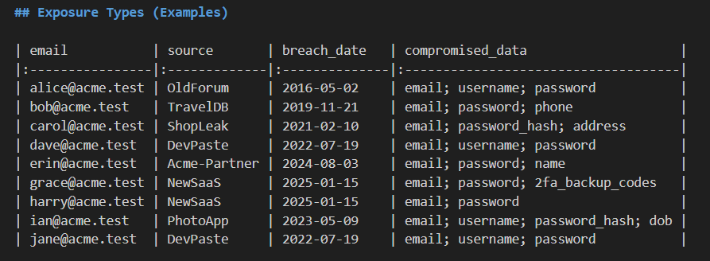

# OSINT Breach Tracker

A fast, ethical **Data Breach & Credential Exposure Tracker** for OSINT-style investigations.  
Give it a **domain** (e.g. `example.com`) or a list of **emails**, and it will:
- Parse breaches from an **offline sample dataset** (provided) *or* optionally query external services (HIBP) if you set an API key.
- Group exposures by **breach/source**, **email**, and **compromised data types**.
- Produce a concise **Markdown report** + **JSON results** you can attach to an investigation.

> ⚠️ **Ethics & Legality**: Use on data you own or have explicit permission to test. Do not target private individuals. All sample data here is fabricated.

---

## Quickstart (Offline Demo)

1. **Create a virtual environment (optional)**  
   ```bash
   python -m venv .venv
   source .venv/bin/activate  # Windows: .venv\Scripts\activate
   pip install -r requirements.txt
   ```

2. **Run against the sample dataset**  
   ```bash
   python breach_finder.py --domain acme.test --offline sample_data/sample_breaches.csv --out examples
   ```

3. **Outputs**  
   - `examples/results.json` – structured summary
   - `examples/sample_run_results.md` – human-readable findings
   - `examples/exposed_accounts.csv` – matched records

---

## Optional: Live Lookups (HIBP)
If you have a **HaveIBeenPwned** API key, you can add live lookups per email (rate-limited).  
Set an environment variable:
```bash
export HIBP_API_KEY="your-key"
```
Then provide `--emails path/to/emails.txt` (one per line). The tool will run offline correlation and then attempt HIBP lookups for those addresses to enrich the report. (This step is optional and can be skipped for the quick demo.)

---

## Usage

```bash
python breach_finder.py [--domain example.com | --emails emails.txt]                         [--offline sample_data/sample_breaches.csv]                         [--out examples]                         [--max-hibp 10]
```

**Arguments**
- `--domain` – Filter by domain (e.g., `company.com`) against offline dataset.
- `--emails` – Path to a text file containing addresses (one per line).
- `--offline` – CSV of breaches with columns: `email,source,breach_date,compromised_data,password_hash(optional)`.
- `--out` – Output folder (default: `examples`).
- `--max-hibp` – Maximum number of email lookups via HIBP (optional).
  
> You can use `--domain` and `--emails` together. The union of both sets will be used.

---

## What it demonstrates (why this is great for OSINT roles)

- **Open-source analysis workflow**: ingest ➜ normalize ➜ correlate ➜ report.  
- **Risk-led reasoning**: flags password reuse risk, old vs. recent breaches, and exposure types.  
- **Ethical framing**: clear scoping, redaction-ready outputs, reproducible results.

---

## Folder Structure

```
osint-breach-tracker/
├── breach_finder.py
├── requirements.txt
├── sample_data/
│   └── sample_breaches.csv
├── examples/
│   ├── sample_run_results.md
│   ├── results.json
│   └── exposed_accounts.csv
└── README.md
```

---
<<<<<<< HEAD

## 🖼️ Screenshots

Below are sample screenshots from the demo run using the offline dataset (`acme.test`):

### 1️⃣ Terminal Execution
Shows the script running successfully and saving results.


### 2️⃣ Report Summary
The main Markdown report generated from the investigation.


### 3️⃣ Exposure Table
Displays the top exposures found during the simulated breach analysis.


### 4️⃣ CSV Output (Optional)
Raw structured data showing exposed email records and breach details.


---

---

